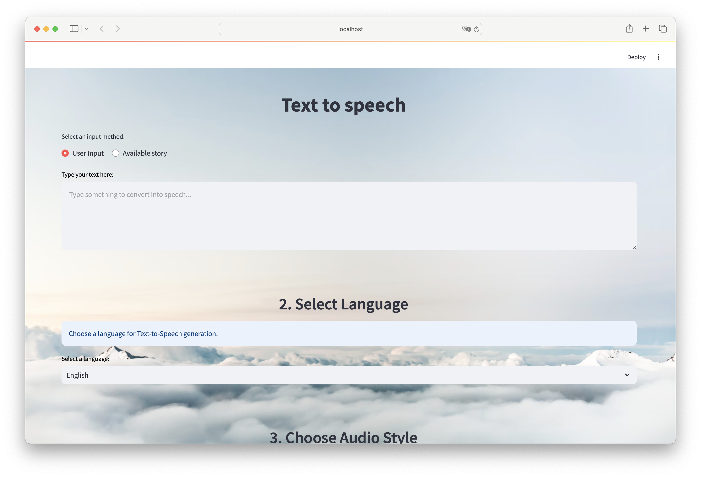

# Voice-Synthesis - XTTS-v2

### How to use
First, clone the this repo
```bash
git clone https://github.com/anhkhoa039/Voice-Synthesis.git
```
Second, clone the XTTS-v2 model
```bash
git clone https://huggingface.co/coqui/XTTS-v2
```
Install requirements
```
pip install -r requirements.txt
```
Run
```
streamlit run src/main.py
```
### TODO
- [ ] Implement smarter segment sentences  
- [ ] Implement multithread to reduce the processing time
